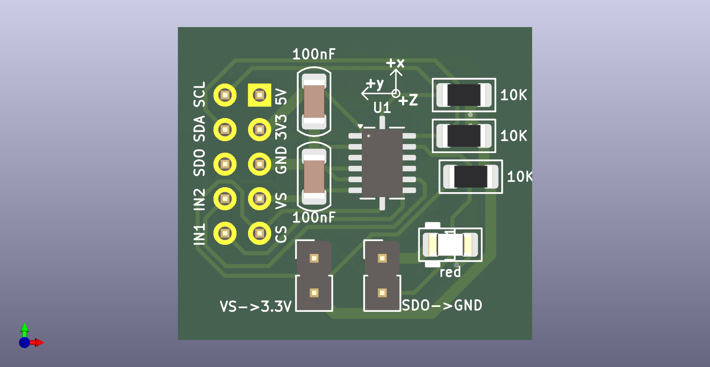
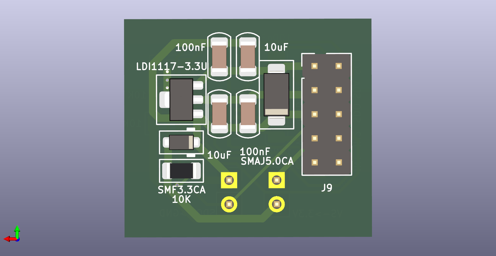

# ADXL345  
  
  
  
  
  
## 模块1  
  
[模块1](https://item.taobao.com/item.htm?abbucket=14&id=665055929696&ns=1&priceTId=2100c82c17466082828256733e0be3&skuId=4968945735643&spm=a21n57.sem.item.81.3ed93903ScD7IM&utparam=%7B%22aplus_abtest%22%3A%22071eb1763aebb2fc6654ad566085d69f%22%7D&xxc=taobaoSearch)  
  
ADXL345是一款小而薄的超低功耗3轴加速度计，分辨率高（13位）今测量范围达士16g。数字输出数据为16位二进制补码格式，可通过SPI（3线或4线）或I2C数字接口访问。ADXL345非常适合移动设备应用。它可以在倾斜检测应用中测量静态重力加速度，还可以测量运动或冲击导致的动态加速度。其高分辨率（3.9mg/LSB），能够测量不到1.0°的倾斜角度变化  
  
ADXL345 三轴重力传感器模块  
  
参数:  
工作电压：DC3.3V/5V  
测量范围：土2/土4/土8/±16  
芯片工作温度：-40℃-80℃  
诸存温度：-40℃-105℃  
尺寸：28mmx14mm  
  
接口定义: 5V 3V3 GND VS CS  
SCL SDA SDO IN2 IN1  
  
接口定义:  
5V: 5V电源  
3V3: 3.3V电源  
GND:地  
Vs:电源电压  
CS:片选  
SCL: I2C串行时钟先/SPI时钟端  
SDA: 串行数据(I2C)/串行数据输入(SPI 4线)/串行数据输入和输出(SPI 3线)  
SDO: 串行数据输出(SPI 4线)/备用I2C地址选择(I2C)  
IN2: 中断2引脚  
IN1: 中断1引脚  
用户注意: 模块在I2C模式下的地址由SDO引脚决定  
  
有1117 LDO 转5V 为 3V3, 具有C1206_10uF*2 + C0805_100nF*2 滤波  
SCL SDA 使用10K上拉  
具有LED LED指示电源正常  
具有 XYZ轴指示  
  
